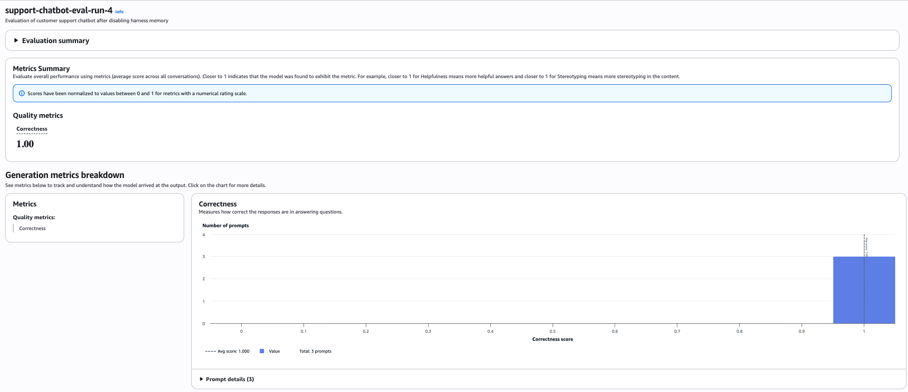
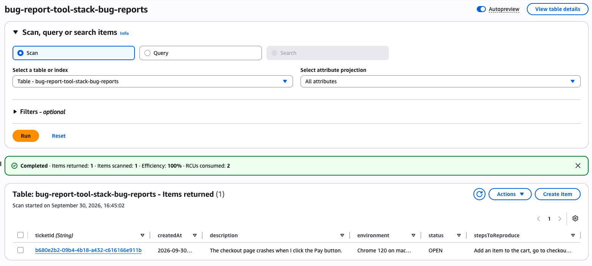

# Customer Support Chatbot with Amazon Bedrock AgentCore

A customer support chatbot built with **Amazon Bedrock AgentCore** as part of my **Udacity Nanodegree program**.

The project demonstrates how an AI-powered customer support agent can classify customer requests, answer platform questions using a provided FAQ, collect structured bug reports, invoke an external tool, and store submitted bug reports in Amazon DynamoDB.

## Project Overview

The chatbot handles three main types of customer requests:

### 1. Bug Reports

- Collects a description of the issue.
- Collects the steps required to reproduce the issue.
- Collects the user's environment.
- Asks for one missing field at a time.
- Calls the `bugreports___create_bug_report` tool only after all required information has been provided.
- Stores the created bug report in Amazon DynamoDB and returns a ticket ID.

### 2. Platform Questions

- Answers questions using only information contained in the provided online-shop FAQ.
- Does not invent answers when the requested information is not available in the FAQ.
- Directs the customer to human support when necessary.

### 3. Other Requests

- Recognizes requests outside the intended customer-support scope.
- Redirects the user to human support instead of attempting to fulfill unsupported requests.

## Technologies Used

- Amazon Bedrock AgentCore
- Amazon Nova Pro
- AgentCore Gateway
- AWS Lambda
- Amazon DynamoDB
- Amazon S3
- Python
- AWS CLI

## Agent Workflow

The chatbot follows this general workflow:

```text
Customer
   |
   v
Amazon Bedrock AgentCore Harness
   |
   v
Request Classification
   |
   +---- Bug Report
   |       |
   |       v
   |   Collect Required Fields
   |   - Description
   |   - Steps to Reproduce
   |   - Environment
   |       |
   |       v
   |   AgentCore Gateway
   |       |
   |       v
   |   AWS Lambda
   |       |
   |       v
   |   Amazon DynamoDB
   |
   +---- Platform Question
   |       |
   |       v
   |   FAQ-based Response
   |
   +---- Other Request
           |
           v
       Human Support
```

## Bug Report Example

For a bug report, the chatbot does not immediately create a ticket when information is incomplete.

Example conversation:

```text
User:
The checkout page crashes when I click the Pay button.

Assistant:
Could you provide the steps to reproduce the issue?

User:
Add an item to the cart, go to checkout, and click the Pay button.

Assistant:
Could you please provide the environment in which you encountered
this issue? For example, the browser and operating system you are using.

User:
Chrome 120 on macOS Sonoma on a MacBook Pro.

Assistant:
[tool call] bugreports___create_bug_report
```

After the required information is collected, the chatbot creates the bug report and returns a ticket ID.

## Evaluation

The chatbot was evaluated using Amazon Bedrock evaluation with the **Builtin.Correctness** metric.

The evaluation dataset included three scenarios:

- An incomplete bug report
- A platform question covered by the FAQ
- An out-of-scope request

The final evaluation achieved:

**Correctness Score: 1.0**

## Evaluation Result



## DynamoDB Bug Report

The following screenshot demonstrates a bug report successfully created by the chatbot and stored in Amazon DynamoDB.



## Testing Artifacts

This repository includes several artifacts used to verify the chatbot behavior:

- `bug_report_transcript.txt` — multi-turn bug-report conversation and tool invocation
- `covered_question_transcript.txt` — FAQ-covered platform question
- `uncovered_question_transcript.txt` — platform question not covered by the FAQ
- `out_of_scope_transcript.txt` — request outside the chatbot's supported scope
- `harness-tests.json` — evaluation test cases
- `output_eval_dataset.jsonl` — generated evaluation dataset
- `observations.txt` — observations from implementation and testing
- `system_prompt.txt` — system prompt defining chatbot behavior

## AgentCore Memory Observation

During testing, managed memory in the AgentCore harness caused information from previous conversations to affect fresh evaluation sessions.

This resulted in a bug-report evaluation case incorrectly reusing information from an earlier interaction and creating a ticket before all required fields had been collected.

For the final harness, managed memory was disabled so that each evaluation session remained independent.

After disabling managed memory:

- Incomplete bug reports correctly triggered follow-up questions.
- FAQ-covered questions were answered correctly.
- Uncovered questions were redirected to human support.
- Out-of-scope requests were handled appropriately.

## Configuration

The real `agentcore_config.json` is intentionally excluded from this public repository because it contains AWS account and resource identifiers.

A sanitized example is provided instead:

`agentcore_config.example.json`

It can be adapted by replacing the placeholder values with the appropriate AWS resource identifiers.

## Repository Structure

```text
.
├── README.md
├── system_prompt.txt
├── chat.py
├── agentcore_config.example.json
├── harness-tests.json
├── output_eval_dataset.jsonl
├── observations.txt
├── bug_report_transcript.txt
├── covered_question_transcript.txt
├── uncovered_question_transcript.txt
├── out_of_scope_transcript.txt
├── evaluation_results.png
├── dynamodb_bug_report.png
└── .gitignore
```

## Learning Outcomes

Through this project, I gained hands-on experience with:

- Building an AI agent using Amazon Bedrock AgentCore
- Designing system prompts for controlled agent behavior
- Integrating an agent with external tools through AgentCore Gateway
- Using AWS Lambda for backend tool execution
- Persisting structured data in Amazon DynamoDB
- Designing multi-turn information collection
- Creating evaluation datasets for agent testing
- Evaluating agent responses using Amazon Bedrock
- Debugging conversation-state and managed-memory behavior

## Note

This repository documents a project completed as part of my Udacity Nanodegree coursework. AWS account-specific configuration values and credentials are not included in the public repository.
